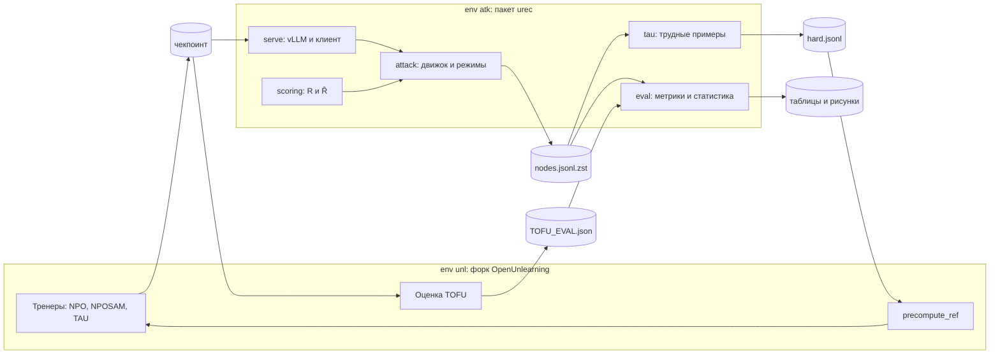

# Часть E: что происходит и зачем

Разбор части E плана (блоки 19–23) и блокнота [`E_repository.ipynb`](../notebooks/E_repository.ipynb). Основы Colab и терминала — в [`A_B_explained.md`](A_B_explained.md), первые запуски OpenUnlearning — в [`D_explained.md`](D_explained.md).

## 1. Зачем нужна часть E

До сих пор OpenUnlearning жил в «песочнице»: каждая сессия скачивала версию `4ad738a` и исправляла в ней ошибку командой `sed` (часть D). Для диплома этого мало. Нужны свой код — пакет `urec` для атак и анализа — и свои изменения внутри OpenUnlearning: методы TAU и NPOSAM, диалоговый датасет. И то и другое должно храниться с историей и одинаково воспроизводиться на любой машине.

Поэтому код диплома живёт в двух репозиториях:

| Репозиторий | Что в нём | Где |
|---|---|---|
| основной — этот | блокноты, разборы, скрипты, lock-файлы, позже пакет `urec`, конфиги, тесты, таблицы и рисунки | `github.com/IvanovskyDev/Machine-Unlearning-in-LLM` |
| форк OpenUnlearning | всё, что меняется внутри фреймворка | `github.com/IvanovskyDev/open-unlearning`, ветка `tau` |

В плане основной репозиторий называется `unlearning-recovery`, у нас его роль играет этот. Основной репозиторий подключает форк как **submodule** (раздел 2).

Блоки 21–23 — архитектура, контракты данных и оркестрация. Их код пишется в вехах M0–M1 (часть F), а в части E нужно понять устройство системы. Этому посвящены разделы 8–10.

## 2. Форк, ветка `tau` и submodule

**Коротко о git.** Репозиторий — папка проекта вместе со всей историей изменений. Коммит — сохранённый снимок изменений с сообщением, что и зачем поменяли; у каждого коммита есть номер (хэш), например `4ad738a`. Ветка — линия коммитов с именем. `git push` отправляет коммиты на GitHub, Pull Request (PR) — просьба влить ветку в `main` с просмотром изменений.

**Форк** — ваша копия чужого репозитория на GitHub, в которую можно коммитить. Её создаёт кнопка Fork на странице репозитория. Изменения авторов OpenUnlearning в неё сами не попадают, поэтому версия фреймворка не поменяется незаметно.

**Ветка `tau`** начинается от закреплённой версии `4ad738a`, с которой сверен весь план. Сейчас в ней три коммита:

| Коммит | Что делает |
|---|---|
| `4ad738a` | версия авторов OpenUnlearning от 18 марта 2026 года |
| Ignore saves symlink | добавляет в `.gitignore` строку `/saves` |
| Upcast logits to float32 in evaluation helpers | правка bf16 из части D, теперь обычным коммитом |

- **`/saves`.** Папка `saves` в Colab — ссылка на Drive. Шаблон `saves*/` в `.gitignore` авторов ловит только настоящие папки, а не ссылки, поэтому нужна отдельная строка. Ловушка: `.gitignore` авторов кончается без перевода строки, и команда плана `echo "/saves" >> .gitignore` склеила бы последнюю строку в `.vscode//saves`. Поэтому перевод строки добавлен перед записью.
- **Правка bf16.** Раньше её каждый раз вносила команда `sed` в шаге 3 части D. Теперь это коммит с объяснением в истории форка, и работает он одинаково везде. Проверено на маленькой модели: вероятности, потери и вероятности токенов побитно совпадают с transformers 4.45.1, как и у правки через `sed`.

**Submodule** — папка основного репозитория, в которой лежит другой репозиторий. Основной репозиторий хранит не файлы форка, а номер одного его коммита. Где лежит форк и за какой веткой он следит, записано в файле `.gitmodules`:

```
[submodule "external/open-unlearning"]
	path = external/open-unlearning
	url = https://github.com/IvanovskyDev/open-unlearning.git
	branch = tau
```

- Клонировать репозиторий нужно сразу с форком: `git clone --recurse-submodules <адрес>`. Без флага папка `external/open-unlearning` останется пустой; тогда поможет `git submodule update --init`.
- В Colab это делает шаг 3 блокнота E. Адрес — `https://…`, а не `git@github.com:…`, как в плане: у Colab нет SSH-ключей, а оба репозитория открыты для чтения.

## 3. Как менять код форка

Основной репозиторий помнит только номер коммита форка, поэтому любая правка в форке — это **два коммита**:

```bash
cd external/open-unlearning
git switch tau                        # после клонирования форк стоит не на ветке, а на коммите (detached HEAD)
# ... правки ...
git add -A && git commit -m "Add TAU trainer" && git push     # 1) коммит в форк
cd ../..
git add external/open-unlearning      # запомнить новый коммит форка
git commit -m "Bump fork: TAU trainer" && git push            # 2) коммит в основной репозиторий
```

- **Detached HEAD** значит «стою на конкретном коммите, а не на ветке». Коммитить в таком состоянии можно, но коммит не попадёт в ветку `tau`. Поэтому перед правками — `git switch tau`.
- **`not our ref`** при `git submodule update` на другой машине значит, что забыли `git push` в форке: основной репозиторий ссылается на коммит, которого на GitHub нет.
- Код пишется на Windows и уходит на GitHub, а в Colab его только запускают (правило из README). Поэтому эти команды выполняются на Windows.

## 4. Ветки, коммиты и Pull Request

- `main` всегда рабочий. Каждая часть и каждая веха — в своей ветке (`part-e-repository`, позже `m0-skeleton`, `m1-serve`, …) и вливается через Pull Request. Даже в одиночку PR даёт удобный просмотр изменений, а с вехи M0 — и проверку тестами на GitHub.
- Коммиты маленькие; сообщение в повелительном наклонении говорит, что и зачем: «Add Budget with exact 128-query accounting».
- Никогда не коммитятся токены, веса моделей, чекпоинты и большие журналы атак.
- Перед основными экспериментами ставится метка `pre-exp2`, в конце — `v1.0-results`.

## 5. Автопроверки при коммите (pre-commit)

Файл `.pre-commit-config.yaml` в корне репозитория описывает проверки, которые запускаются перед каждым коммитом:

| Проверка | Что делает |
|---|---|
| `ruff` | ищет ошибки в коде Python и исправляет простые (`--fix`) |
| `ruff-format` | приводит код Python к единому оформлению |
| `check-added-large-files` | не даёт закоммитить файл больше 5 МБ — например, случайно попавшие веса |
| `end-of-file-fixer` | файл должен заканчиваться переводом строки |
| `trailing-whitespace` | убирает пробелы в конце строк |

- Версия ruff — 0.6.9, как у самого OpenUnlearning: стиль кода в форке и в `urec` будет одинаковым.
- Блокноты ruff не проверяет (`exclude: ^notebooks/`): он переформатировал бы ячейки и сломал выровненные комментарии, а блокноты у нас для запуска и просмотра, не для логики.
- Папку `envs/` не трогает ни одна проверка (`exclude: ^envs/` в начале файла). Lock-файлы записывают программы, и они должны совпадать с копией на Drive байт в байт. Например, `models.lock.json` кончается без перевода строки, и `end-of-file-fixer` иначе дописал бы его.
- Если проверка сама исправила файл, коммит останавливается с сообщением `files were modified by this hook`. Тогда нужно ещё раз сделать `git add` исправленных файлов и повторить коммит.
- Проверки уже сработали на этой части: ruff нашёл в `check_atk.py` импорты посреди файла (правило E402), и скрипт переписан с импортами в начале.

**Как включить проверки на своём компьютере** (нужен Python для Windows):

```bash
pip install pre-commit
pre-commit install            # в папке репозитория; один раз
pre-commit run --all-files    # по желанию: проверить все файлы сразу
```

После `pre-commit install` проверки идут сами при каждом `git commit`. С вехи M0 те же проверки будут выполняться и на GitHub при каждом push.

## 6. `.gitignore` и `.gitattributes`

`.gitignore` перечисляет то, что в git не попадает:

- кэши Python и инструментов — `__pycache__/`, `.ruff_cache/` и другие;
- тяжёлое и сырое — `/results/raw` (ссылка на Drive), `/logs/`, `/saves`, `*.safetensors`, `*.bin`, `*.pt`, `*.npy` (веса и массивы);
- секреты — `.env`, `.git-credentials`.

Маленькие данные (`data/items` и др.), итоговые таблицы и рисунки хранятся в git.

`.gitattributes` задаёт, как git обращается с переводами строк:

- `*.sh text eol=lf` — у скриптов bash всегда переводы строк Linux. Скрипты запускаются в Linux (Colab), а git на Windows по умолчанию меняет переводы строк на свои. Со «виндовыми» переводами строк bash падает со странными ошибками вроде `$'\r': command not found`.
- `envs/* -text` — lock-файлы git не меняет никогда: они хранятся и выдаются байт в байт.

## 7. Структура репозитория (блок 20)

| Путь | Что там | Когда наполняется | В git |
|---|---|---|---|
| `README.md` | описание проекта и как всё воспроизвести | сейчас, дополняется по ходу | да |
| `docs/` | разборы частей для новичка | сейчас | да |
| `notebooks/` | блокноты Colab: запуск и просмотр | сейчас | да |
| `scripts/` | скрипты запуска: `measure.sh`, `start_vllm.sh`, `stop_vllm.sh`, `check_atk.py` — перенесены из блокнотов B и D | сейчас; позже `check_env.sh` и др. | да |
| `envs/` | lock-файлы окружений и ревизии моделей | сейчас | да |
| `external/open-unlearning/` | форк OpenUnlearning (submodule) | сейчас | номер коммита |
| `configs/` | Hydra-конфиги `urec` (раздел 10) | вехи M0–M1 | да |
| `src/urec/` | пакет `urec` (раздел 8) | с вехи M0 | да |
| `tests/` | тесты на CPU | с вехи M0 | да |
| `data/` | маленькие данные: `items/`, `calibration/`, `annotation/`, `retain_regimes/` | с вехи M0 | да |
| `results/raw` | ссылка на `results_raw` на Drive | создаётся в Colab (шаг 4 блокнота E) | нет |
| `results/tables/`, `results/figures/` | итоговые таблицы (CSV, LaTeX) и рисунки (PDF) | вехи M4 и M8 | да |
| `analysis/` | статистика вне Python (R) | веха M4 | да |
| `thesis/` | исходники диплома в LaTeX | по ходу | да |
| `logs/` | логи шагов | в Colab | нет |

- Пустые папки содержат файл `.gitkeep`: git не хранит пустые папки, а так структура видна сразу.
- Файлы `pyproject.toml`, `Makefile` и `.github/workflows/ci.yml` появятся в вехе M0, `PREREGISTRATION.md` — до эксперимента Exp2.
- **Lock-файлы.** Главные копии теперь в `envs/` репозитория. Копии на Drive остаются для блокнотов B–D, и шаг 5 блокнота E проверяет, что они одинаковы.
- **Журнал** пока остаётся на Drive: его дописывают ячейки Colab, а коммитить из Colab мы не будем. Решение, принятое в вехе M0, — в разборе F_M0, раздел 16.

**Что где живёт — короткое правило.** Логика — только в `src/urec` и в форке; параметры — только в `configs/`; команды запуска — в `scripts/` (позже и в `Makefile`); блокноты только запускают шаги и рисуют, но ничего не вычисляют для таблиц диплома.

## 8. Архитектура (блок 21)

Окружения `unl` и `atk` нельзя смешать: в них разные версии torch и transformers (часть B). Поэтому система — два независимых «мира», которые общаются **только через файлы на диске**:

- **форк OpenUnlearning в `unl`** обучает и оценивает модели;
- **пакет `urec` в `atk`** разговаривает с моделями через vLLM, атакует, оценивает ответы и анализирует результаты.

Оркестратор запускает шаги по очереди, каждый — в своём окружении. В плане это `conda run -n <окружение> …`; у нас окружения — папки uv, поэтому шаг запускается питоном своего окружения: `/content/envs/unl/bin/python …` или `/content/envs/atk/bin/python …`.



Цилиндры — файлы-интерфейсы. Цикл «атака → трудные примеры → обучение» — один раунд TAU. Какой файл где и каким шагом появляется:

| Файл | Окружение | Шаг | Кто пишет |
|---|---|---|---|
| чекпоинт (`saves/unlearn/<run>`) | `unl` | `unlearn` | тренер форка |
| `TOFU_EVAL.json` | `unl` | `eval` | оценка TOFU форка |
| `nodes.jsonl.zst` | `atk` | `attack` | движок атаки `urec.attack` |
| `hard.jsonl` | `atk` | `tau_round` | `urec.tau`, дальше его читает `precompute_ref` в `unl` |
| таблицы и рисунки | `atk` | `summarize` и анализ | `urec.eval` |

**Слои пакета `urec`.** Модуль может импортировать только модули из слоёв с меньшим номером (выше по таблице). Так основа и данные не тянут тяжёлые библиотеки моделей и атаки:

| Слой | Модули | Тяжёлые библиотеки | Нужна GPU |
|---|---|---|---|
| 0. Основа | `urec.types`, `urec.io`, `urec.config` | нет | нет |
| 1. Данные | `urec.data` | datasets, spaCy, sentence-transformers | для эмбеддингов желательна |
| 2. Модели и оценка ответов | `urec.serve`, `urec.scoring` | vllm, openai, bert-score, spaCy | да |
| 3. Атака | `urec.attack` | — (через слой 2) | через слой 2 |
| 4. Анализ и данные TAU | `urec.eval`, `urec.tau` | scipy, statsmodels, lifelines, scikit-learn, transformers | только пробинг |
| 5. Оркестрация | `urec.pipeline`, `urec.cli` | hydra-core | нет |

**Правила кода и зачем они:**

- **Контракт → тест → код.** Сначала сигнатура функции и формат данных, потом тест, потом реализация. Ошибки ловятся на CPU за секунды, а не на GPU через час обучения.
- **Всё, что можно, проверяется без GPU.** Движок атаки и оценщик — на «фейковых» моделях со скриптованными ответами, тренеры форка — на крошечной случайной Llama. Так мы уже проверяли правку bf16 и новые шаги части D.
- **Никаких чисел в коде.** Все параметры — в Hydra-конфигах. Рядом с каждым результатом сохраняются снимок конфига, коммит и версии пакетов.
- **Файлы — единственный интерфейс** между окружениями: `urec` и форк не импортируют друг друга.
- **Тяжёлые библиотеки импортируются внутри функций** (`import vllm` — там, где он нужен), чтобы тесты на CPU не тянули vLLM и CUDA.
- **Асинхронность — только в `serve` и `attack`.** Остальное — обычные функции, по возможности без побочных эффектов.
- **Каждый шаг — одна команда** `python -m urec.cli <шаг> run=<имя>`: читает входные файлы, атомарно пишет выходные и ставит маркер `DONE`. Повторный запуск пропускает выполненные шаги — как шаг 25 части D пропускал готовые варианты.
- **Типы везде** (`mypy --strict` для слоёв 0–3), оформление и проверки — ruff.

## 9. Контракты данных (блок 22)

**Контракт** — договорённость о формате данных между частями программы. Если атака пишет узлы в одном формате, а анализ читает в другом, числа портятся молча. Поэтому все структуры описываются один раз — как dataclass-ы в `urec/types.py` с полем `schema_version` — и меняются сначала в плане, потом в коде.

| Класс | Что описывает | Файл |
|---|---|---|
| `QAItem` | вопрос TOFU: `item_id`, вопрос, эталонный ответ, ключевые факты, `evaluable` | `data/items/{split}.jsonl` |
| `Node` | один ход атаки: запрос, ответ, оценка R, успех | строка `nodes.jsonl.zst` |
| `ItemResult` | итог атаки по одному вопросу | строка `items.csv` |
| `HardExample` | трудный диалог для обучения TAU | строка `tau/round{k}/hard.jsonl` |
| `RunSpec` | описание одного запуска: модель, сплит, метод, сид, режимы атаки | `results/raw/{run}/spec.yaml` |
| `Manifest` | что и как было запущено: коммиты, хэши lock-файлов, железо, статусы шагов | `results/raw/{run}/manifest.json` |

Правила контрактов:

- запись идёт во временный файл, затем он атомарно переименовывается; маркер `DONE` пишется последним, поэтому оборванный запуск не оставит полузаписанный файл, похожий на готовый;
- JSONL пишется через orjson и сжимается zstd; при чтении проверяются `schema_version` и обязательные ключи;
- `item_id` (например, `forget05/0137`) одинаков во всех файлах: по нему склеиваются атаки, оценка и пробинг;
- вопросы с `evaluable = False` остаются в забывании, но не входят в метрики атаки; их число указывается в отчёте.

`urec/types.py` пишется в вехе M0 ровно по блоку 22 плана, вместе с тестом «записал → прочитал → получил тот же объект» для каждого класса.

## 10. Конфигурация и оркестрация (блок 23)

Один запуск описывается одним `RunSpec`. Оркестратор `urec.pipeline` превращает его в последовательность шагов, каждый — в своём окружении, и пропускает уже выполненные (по маркеру `DONE`):

| Шаг | Окружение | Вход | Выход |
|---|---|---|---|
| `unlearn` | `unl` | `RunSpec`, target-модель | `saves/unlearn/{run}` |
| `eval` | `unl` | чекпоинт | `eval/TOFU_EVAL.json` |
| `attack` (на каждый режим × атакующего × сид) | `atk` | чекпоинт, `data/items`, порог θ | `attack/*/nodes.jsonl.zst`, `items.csv`, `perf.json` |
| `summarize` | `atk` | все `items.csv` и оценка | `summary.json` |
| `probe` (Exp3) | `atk` | чекпоинт | `probe/*` |
| `tau_round` (Exp4) | `atk` → `unl` | журналы атаки | `tau/round{k}/*`, новый чекпоинт |
| `cleanup` | — | `keep_checkpoint` | загрузка на Hugging Face или удаление |

- **Команда форка собирается функцией**, а не пишется вручную: `urec.pipeline.fork_overrides(spec)` превращает `RunSpec` в строку Hydra-добавок. Сплиты берутся из одной таблицы соответствий: forget01 ↔ retain99 и holdout01, forget05 ↔ retain95 и holdout05, forget10 ↔ retain90 и holdout10.
- **Решения части D войдут в эти добавки:** веса во float32 и внимание `sdpa` при обучении, `eval.tofu.overwrite=true` при оценке.
- **Конфиги `urec`** — дерево Hydra в `configs/`: пути, настройки сервера vLLM, атакующие модели, режимы атаки, оценщик, режимы retain, сетки экспериментов.
- **Сетки экспериментов.** Команда `python -m urec.cli expand sweep=<имя>` разворачивает сетку в список `spec.yaml`, а `scripts/run_queue.sh` выполняет его по очереди. У нас нет кластера, поэтому очередь идёт в Colab.

## 11. Блокнот E построчно

**Шаги 1–2** — старт сессии, как в части D. Новое — переменная `REPO = "/content/repo"`: сюда клонируется репозиторий. `os.environ["REPO"]` делает её видимой в ячейках `%%bash` как `$REPO`.

**Шаг 3 — клонирование с форком.**

- `git clone -q --recurse-submodules <адрес> $REPO` скачивает репозиторий и сразу форк в `external/open-unlearning`.
- `git log -1 --format='репозиторий: %h %s'` печатает короткий номер (`%h`) и сообщение (`%s`) последнего коммита.
- `git submodule status` показывает, какой коммит форка закреплён в основном репозитории.
- `git log -3` внутри форка показывает три последних коммита: два наших и `4ad738a`.
- `grep -n` находит три строки с `output.logits.float()`: правка bf16 уже в коде, `sed` не нужен.

**Шаг 4 — ссылки на Drive.**

- `ln -s <куда> <где>` создаёт ссылку: `saves` форка и `results/raw` ведут на Drive, как в части D.
- `ls -ld` показывает саму ссылку, а не содержимое папки, на которую она ведёт.
- `git status --porcelain` печатает изменённые и новые файлы в кратком виде; `-z "$(…)"` значит «вывод пуст». Если пусто, ссылки в git не попали: их отсекают строки `/saves` в `.gitignore` форка и `/results/raw` в `.gitignore` репозитория.

**Шаг 5 — устройство и lock-файлы.** `cat .gitmodules` печатает описание submodule, `ls` — папки. `cmp файл1 файл2` сравнивает файлы побайтно: одинаковые — молчит и выдаёт успех (`&&` печатает «совпадает»), разные — пишет, где первое отличие.

**Шаг 6 — окружение `unl`** собирается так же, как в шаге 4 части D, но из `$REPO/envs/requirements-unl.lock`. В конце — проверка версий из шага 7 части B.

**Шаг 7 — модель M** скачивается по ревизии из `envs/models.lock.json` репозитория. `[:7]` — первые 7 знаков хэша ревизии.

**Шаг 8 — оценка кодом форка.** Команда та же, что в шаге 9 части D, но запускается из `$REPO/external/open-unlearning`, а скрипт замера берётся из `$REPO/scripts/`. Имя запуска — `sandbox_fork_eval_1B_full_f01`, результаты попадают на Drive через ссылку `saves`.

**Шаг 9 — сверка с авторами**, как шаг 11 части D. На A100 все метрики должны совпасть; на L4 возможны небольшие расхождения у ROUGE, extraction_strength и FQ (разбор D, раздел 5).

**Шаг 10 — журнал.** `repo_commit = !git -C $REPO log -1 --format=%h` сохраняет вывод команды в список строк; `-C папка` значит «выполнить git в этой папке». В запись попадают коммиты репозитория и форка, GPU и числа оценки.

**Шаг 11** — конец сессии, как шаг 27 части D.

## 12. Готово, когда

- форк `IvanovskyDev/open-unlearning` существует, в ветке `tau` два наших коммита поверх `4ad738a`;
- основной репозиторий подключает форк как submodule, который смотрит на ветку `tau`;
- в Colab `git clone --recurse-submodules` работает, ссылки на Drive в git не попадают (шаги 3–4);
- lock-файлы лежат в `envs/` и совпадают с копией на Drive (шаг 5);
- форк оценивает M так же, как песочница части D (шаги 8–9);
- автопроверки срабатывают при коммите (раздел 5);
- папки созданы, скрипты перенесены в `scripts/`;
- вы можете сказать, в каком окружении и каким шагом появляется каждый файл на схеме из раздела 8.

## 13. Частые ошибки

| Что видно | Причина | Что делать |
|---|---|---|
| папка `external/open-unlearning` пустая | репозиторий склонирован без `--recurse-submodules` | `git submodule update --init` в папке репозитория |
| `fatal: … not our ref` | в основном репозитории коммит форка, который не отправлен на GitHub | `git push` в форке (раздел 3) |
| `HEAD detached at …` в форке | после клонирования форк стоит на коммите, а не на ветке | перед правками `git switch tau` |
| `files were modified by this hook` при коммите | автопроверка сама исправила файл | `git add` исправленных файлов и коммит ещё раз |
| `$'\r': command not found` в bash | скрипт сохранён с переводами строк Windows | пересохранить его с переводами Linux (в VS Code: внизу справа `CRLF` → `LF`); скрипты из репозитория от этого защищены правилом в `.gitattributes` |
| `git status` в шаге 4 не пуст | в git попадает что-то лишнее | прочитать список: обычно это новая ссылка или папка, которую надо добавить в `.gitignore` |
| `cmp: … differ` в шаге 5 | копия lock-файла на Drive отличается от репозитория | окружения пересобирали без обновления репозитория; главная копия — в `envs/` репозитория |
| `Filename too long` на Windows | длинные пути в папке репозитория | `git config --global core.longpaths true` |
